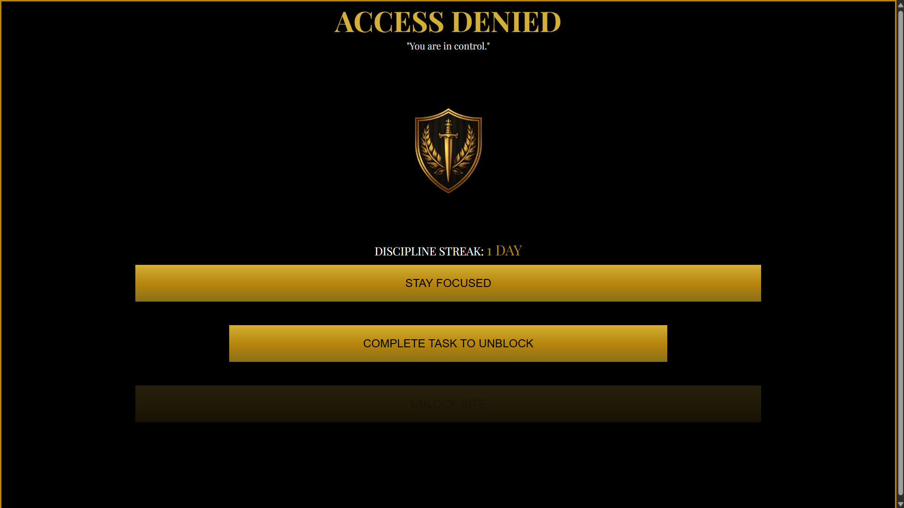
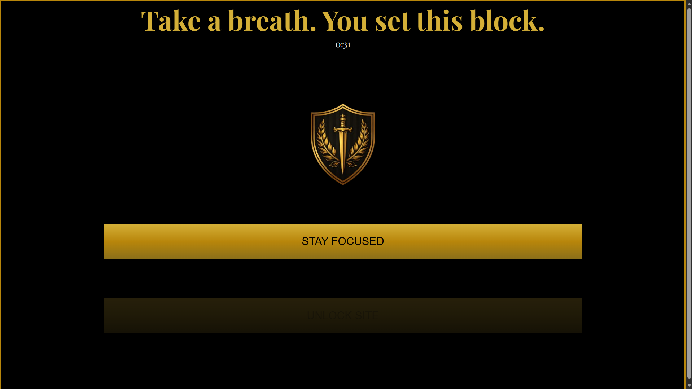
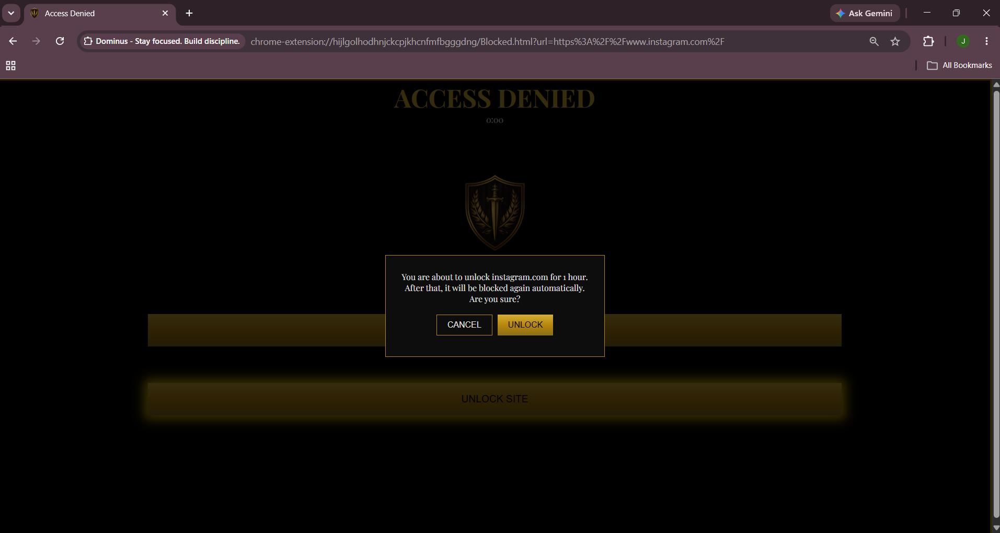
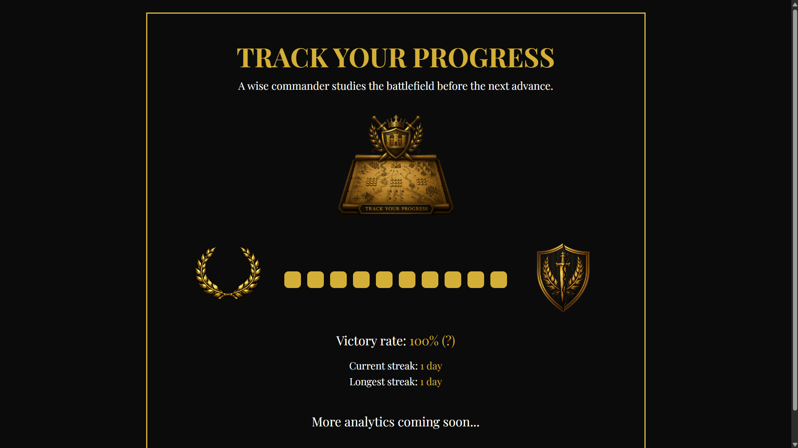

# Dominus

A free, open-source Chrome extension designed to help users reduce distractions and build better digital habits. 

## Features

- Website blocking
- Custom categories
- Self accountability
- Easy configuration

## Installation

Live on the chrome webstore here: [Dominus](https://chromewebstore.google.com/detail/fomplffbhfacdafjgiigkchoebbkcbjd?utm_source=item-share-cb)

## Roadmap

- [x] Statistics page
- [ ] Password-protected settings
- [ ] Scheduling
- [ ] Sync across devices

## Screenshots

| Popup | Build Your Fortress |
|:---:|:---:|
|  |  |
| **Blocked page** | **Cooldown** |
|  |  |
| **Unlock** | **Track Your Progress** |
|  |  |
