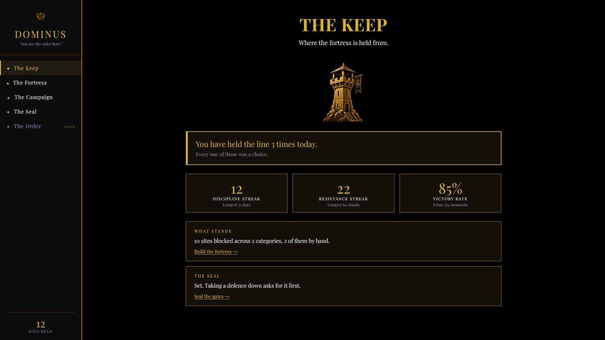
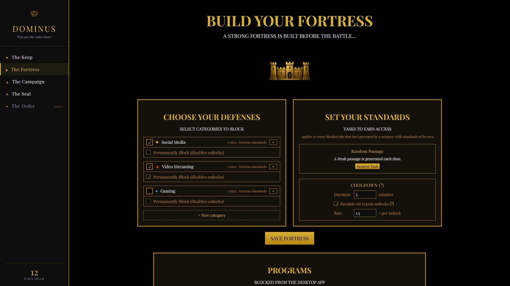
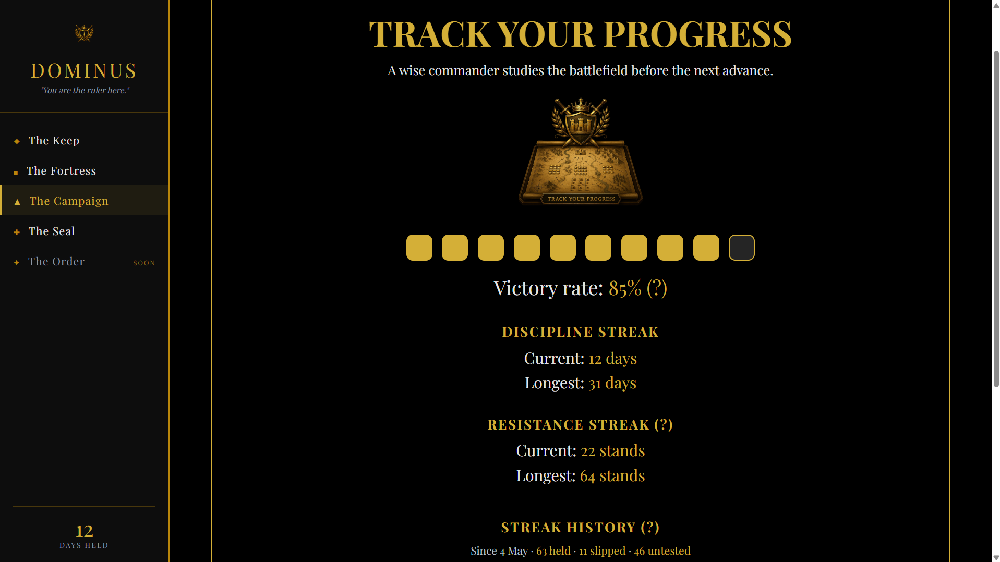
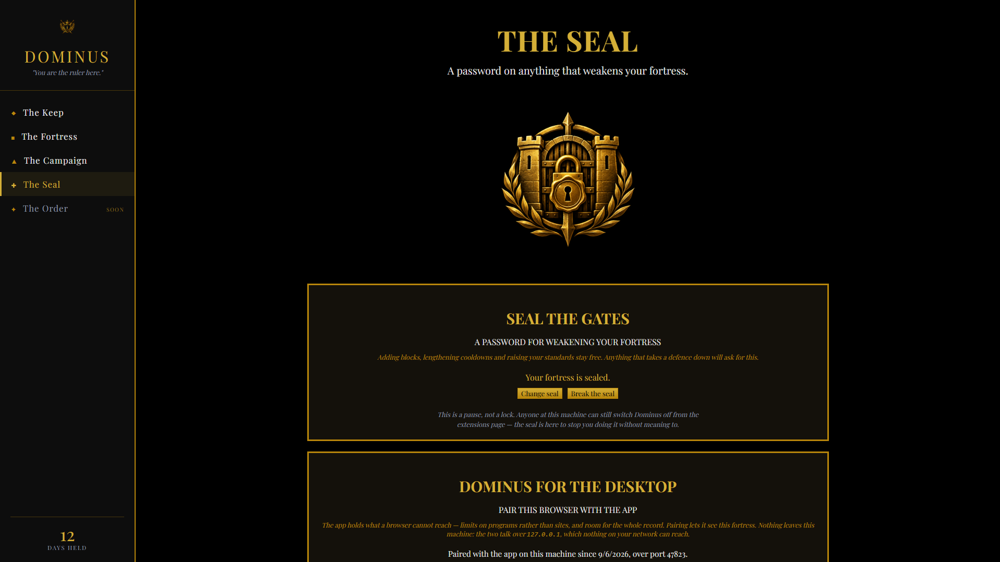

# Dominus

A free, open-source Chrome extension that blocks the sites that pull you away —
and makes going back to them cost something.

Not a wall. A gate you have to mean to open.

Dominus is built for someone who chose the constraint, not for locking down
someone fighting to get out. Every gate names what you are giving up and then
lets you through. The friction exists to make the decision deliberate, not to
make it impossible.

## Features

**Blocking**
- Block a site from the toolbar, or switch on a category and block a dozen
- Custom categories — rename, re-stock, or invent your own
- Permanent blocks, for the ones that shouldn't have an unlock at all

**What an unlock costs — decided in advance, while you're thinking clearly**
- A cooldown you have to sit through
- A passage you have to type out, or a Guarded Code you have to go and fetch
- Escalating cooldowns for repeat unlocks, capped so they can't become a lockout
- Per-category tasks and cooldowns, so gaming can cost more than the news

**One window**
- *The Keep* — where you stand right now, including gates you've left open
- *The Fortress* — what's blocked, and what it costs to unlock
- *The Campaign* — victory rate, both streaks, and a year of history, one square per day
- *The Seal* — a password on anything that weakens your fortress

**Keeping it**
- Export your fortress to a file and import it back
- Importing merges rather than overwrites: it can never take a defence down
- Everything stays in your browser — no account, no server, nothing sent anywhere

## Installation

Find projects like this here: [AJ7 developments](https://aj7developments.com)

## Roadmap

- [x] Statistics page
- [x] Password-protected settings
- [x] Export / import your fortress
- [ ] Scheduling
- [ ] Sync across devices
- [ ] Desktop app (app limits, full dashboard)

## Screenshots

Dominus is one window. The rail stays put; the views change.

| The Keep | The Fortress |
|:---:|:---:|
|  |  |
| *Where you stand right now* | *What is blocked, and what it costs to unlock* |
| **The Campaign** | **The Seal** |
|  |  |
| *Streaks, victory rate and a year of history* | *A password on weakening it — and a copy you can keep* |

When you meet a blocked site, and while the cooldown runs:

| Blocked page | Cooldown |
|:---:|:---:|
|  |  |

The popup blocks whatever you are looking at without leaving the page:

