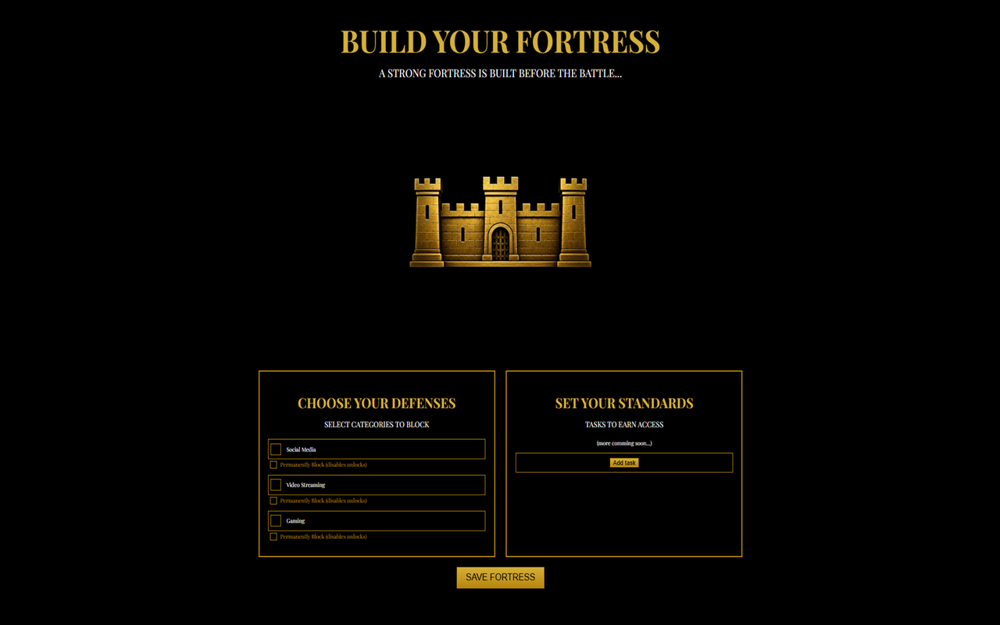
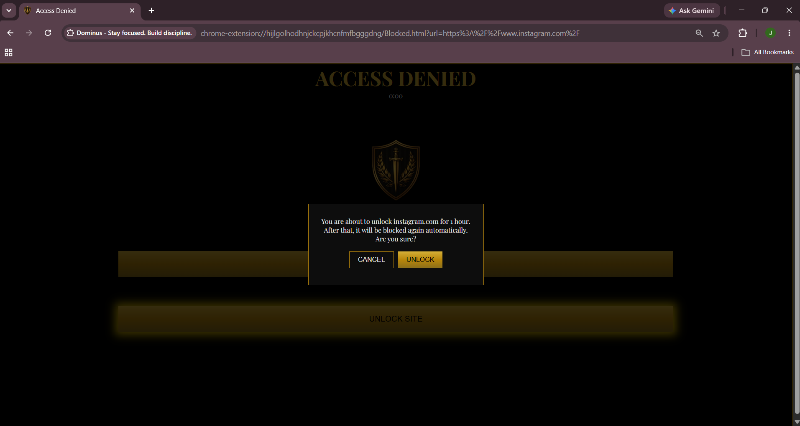

# Dominus

A free, open-source Chrome extension designed to help users reduce distractions and build better digital habits. 

## Features

- Website blocking
- Streak history you can read at a glance
- Custom categories
- Per-category unlock tasks and cooldowns
- A password on anything that weakens your fortress
- Self accountability
- Export and import your fortress
- Easy configuration

## Installation

Find projects like this here: [AJ7 developments](https://aj7developments.com)

## Roadmap

- [x] Statistics page
- [x] Password-protected settings
- [x] Export / import your fortress
- [ ] Scheduling
- [ ] Sync across devices
- [ ] Desktop app (app limits, full dashboard)

## Screenshots

| Popup | Build Your Fortress |
|:---:|:---:|
|  |  |
| **Blocked page** | **Cooldown** |
|  |  |
| **Unlock** | **Track Your Progress** |
|  |  |
